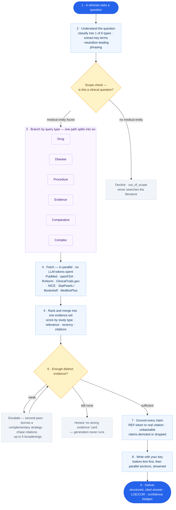

# Iatronix

Evidence-based medical reference for clinical professionals. Ask a clinical question; Iatronix retrieves
live data from 10+ authoritative medical sources in parallel, ranks it by evidence quality, then uses
**your own LLM key** to format the result into structured, citable sections — with a Level of Evidence
(LOE I–III) and Class of Recommendation (COR I–III) attached to every claim.

**Live:** [med.kayomarz.com](https://med.kayomarz.com)


<sub>Benchmark badges reflect the RAGnosis run described in **[Benchmark](#benchmark--does-it-stay-honest-under-pressure)** below — an offline, Claude-stand-in evaluation, not a live production metric. Read the caveats there.</sub>

> **No static knowledge base, and never the model's training data.** Every rendered answer is grounded in
> data retrieved at query time. If retrieval can't find citable evidence, Iatronix returns an honest
> "not enough evidence" card instead of a confident guess.

---

## What it does

You type a clinical question. Iatronix:

1. Rewrites and classifies the query (drug / disease / comparative / procedure / evidence / complex).
2. Neutralizes loaded phrasing so the evidence search isn't biased toward the conclusion you hinted at.
3. Fetches live data from 10+ free medical APIs **in parallel** (zero LLM tokens spent here).
4. Ranks every retrieved article by evidence quality (study type, recency, relevance, full-text, citations).
5. Enforces an **evidence floor** — if nothing citable is found, it broadens the search before giving up.
6. Uses **your encrypted LLM key** to write a short BLUF summary, then generates each section in parallel.
7. Runs a **grounding gate** over the result — any claim that can't be tied to a real source is demoted or
   dropped, and if too little remains grounded, the answer becomes an honest "no evidence" card.
8. Attaches a real, article-level citation link to every surviving claim.

The LLM is used as an **editor of retrieved evidence**, never as the source of the facts.

---

## What's functional today

A snapshot of what actually works on the live site right now.

| Capability | Status | Notes |
|---|---|---|
| Evidence-grounded clinical search | ✅ Live | 6 query types, per-claim LOE/COR grading |
| Bring-Your-Own-Key (BYOK) | ✅ Live | Cerebras (default) + Anthropic Claude enabled; keys Fernet-encrypted at rest |
| Provider-agnostic model layer | ✅ Live | One config file (`providers.yaml`) drives backend routing **and** the frontend key/model picker |
| Progressive streaming results | ✅ Live | BLUF summary appears first, then each section streams in as its agent finishes (SSE) |
| Resumable streaming | ✅ Live *(flag)* | A search survives a mobile tab-switch / screen-off and reconnects where it left off |
| Grounding gate + evidence floor | ✅ Live | Guarantees answers come from retrieved evidence, never training data |
| Stance neutralization (anti-sycophancy) | ✅ Live *(flag)* | Balanced evidence even when the question is phrased to push a conclusion |
| Multi-variation retrieval | ✅ Live *(flag)* | Searches several phrasings of the question to de-bias the evidence base |
| Per-section re-fetch | ✅ Live *(flag)* | A still-empty section triggers a targeted re-fetch + re-write of just that section |
| Deep citation-chasing | ✅ Live *(flag)* | When retrieval is thin, follows references forward/backward (iCite) to find grounding |
| Article registry (real citation links) | ✅ Live | Every citation resolves to an article-level URL — never a homepage fallback |
| Semantic + exact-match caching | ✅ Live | Redis exact-match (always on) + pgvector cosine-similarity cache (configurable) |
| Waves — spirometry analysis | ✅ Live | Upload a spirometry image → Claude vision → ATS/ERS interpretation |
| Waves — ECG | 🟡 Coming soon | Placeholder in the UI |
| Firebase authentication | ✅ Live | Email/password **and Google sign-in** (client SDK + server-side Admin SDK); Google merges safely into an existing password account |
| Cloud hosting + auto-deploy | ✅ Live | Google Cloud Run (two scale-to-zero services) + push-to-`main` CI/CD via GitHub Actions (keyless Workload Identity Federation) |
| Retention archival to GCS | ✅ Live | Daily background job archives audit/cache rows to Google Cloud Storage (gzipped JSONL) **before** purging — never deletes an un-archived row |

*(flag)* = controlled by a feature flag in `.env`, so it can be turned on/off per environment without a code change.

---

## How a search works — the pipeline

Every question follows the same path: it is understood, scope-checked, branched to the right strategy,
searched across trusted sources in parallel, merged into one evidence set, gated on confidence, grounded
to real citations, then written and delivered. **No LLM token is spent until real evidence has been
retrieved and quality-checked.**



<details>
<summary><strong>Stage-by-stage — the engineering detail (with the feature flag that controls each)</strong></summary>

| Stage | What actually happens | Flag |
|---|---|---|
| **Query analysis** (DSPy) | Typos fixed, abbreviations expanded (HTN → hypertension, MI → myocardial infarction); extracts entities, clinical intent (10 intents), and patient context (age / renal / hepatic / weight / pregnancy / concurrent drugs). | — |
| **Stance neutralization** | "why is X *NOT* rational?" → neutral "X: clinical rationale and evidence base". The neutral form is what gets searched, so retrieval isn't one-sided. | `STANCE_NEUTRALIZER_ENABLED` |
| **Classification + scope guard** | 6 types; precedence is user hint > DSPy analysis > LLM classifier > safe `complex` fallback. Malformed output is recovered, not dropped; ≥2 named conditions force the multi-condition path. If no medical term is found at all, it politely declines — no fetch, no generation. | `CLASSIFY_HEURISTIC_BACKSTOP_ENABLED`, `NON_MEDICAL_GUARD_ENABLED` |
| **Cache lookup** | Redis exact-match (24h) on the normalized query → instant return; pgvector semantic cache (cosine similarity) catches near-duplicate questions. | `SEMANTIC_CACHE_ENABLED` |
| **Parallel fetch** (no LLM tokens) | `asyncio.gather` across 10+ medical APIs; each source times out and fails silently. Complex queries cascade PubMed across comorbidity combinations; multi-variation retrieval fetches several phrasings. | `MULTI_VARIATION_SEARCH_ENABLED` |
| **Evidence ranking** | Every article scored by study type, relevance, recency, full-text availability, and citation count; animal-only / off-population studies are penalized; the highest-evidence articles survive the abstract budget. | — |
| **Confidence gate + evidence floor** | Same-strategy second pass + phrasing variants; if still under 3 distinct articles, borrow ONE complementary strategy (procedure→evidence, …); then up to 5 progressive broadenings; still thin → deep citation-chasing (iCite). All exhausted → honest "no evidence" card. | `ADAPTIVE_CROSS_STRATEGY_FALLBACK_ENABLED`, `DEEP_SEARCH_ENABLED` |
| **LLM formatting** (your key) | Phase 1: BLUF agent streams the headline + section titles immediately. Phase 2: one agent per section in parallel, each streaming in as it finishes. Every article is tokenized as `[REF_N]` — the model cites tokens, not free-text titles. | `PARALLEL_SECTIONS_ENABLED` |
| **Grounding gate** | `[REF_N]` tokens resolved to real titles/PMIDs/URLs; claims with no real source are demoted (low-confidence) or dropped; too few grounded claims → the honest "no evidence" card; per-section re-fetch fills any section still empty. | `GROUNDING_FLOOR_ENABLED`, `SECTION_REFETCH_ENABLED` |
| **Validation + cache store** | LOE/COR assigned structurally by source type — not inferred from the model's wording; the article registry builds the final reference list (every link is article-level); only grounded answers are cached. | — |

</details>

---

## How answers stay grounded (hallucination prevention)

Iatronix layers several independent mechanisms so the model can't invent clinical facts:

1. **Evidence floor** — before any answer is written, at least one citable source (PMID, NCT ID, DOI, NICE or
   FDA label URL) must exist. If not, up to five progressive broadening searches run; if those fail too, the
   pipeline stops and returns a `no_evidence` card. Generation never proceeds on empty evidence.

2. **Grounding gate** — after the model writes the answer, every claim is checked against the retrieved
   evidence. Ungrounded claims are **demoted** to low-confidence (shown with a badge) or dropped. If too few
   grounded claims remain, the whole answer is replaced with the honest "no evidence" card. This is the
   guarantee that a rendered answer is *retrieved evidence*, never training data.

3. **`[REF_N]` citation tokens** — each fetched article gets a deterministic token in the data block. The
   model emits `[REF_3]` instead of typing a title it might hallucinate; a post-processor maps tokens back to
   real titles/PMIDs/URLs. This is LLM-agnostic — it works the same across Cerebras, Claude, GPT, Gemini, etc.

4. **Article registry** — a single post-fetch source of truth with the hard guarantee that **every entry has
   a validated article-level URL**. References that can't be resolved to a real article are excluded entirely —
   there are no homepage fallbacks anywhere in the system. Ungrounded inline claims show an amber *Unverified*
   badge instead of a fake link.

5. **Structural LOE/COR** — evidence levels are assigned by source type in code, not inferred from the model's
   phrasing. A case report cannot be upgraded to LOE I no matter how confidently the model writes.

6. **Stance neutralization** — loaded query phrasing ("why is X *not* rational?") is rewritten to a neutral
   clinical question for retrieval, and anti-sycophancy rules are injected into every prompt, so the answer
   reflects the evidence rather than the framing.

7. **Strict citation validation** — for `complex` and `procedure` queries, any claim whose source isn't in the
   fetched data block is dropped, preventing the model from smuggling in training-knowledge recommendations.

---

## Benchmark — does it stay honest under pressure?

The mechanisms above are the *design*. This is the *measurement*. We ran **RAGnosis** — 120 MRCP-style
clinical multiple-choice questions and deliberate "trap" questions — end-to-end through the real retrieval
pipeline, then scored every answer on two axes: **is it correct**, and (more importantly) **is it faithful** —
does it ever assert something the retrieved evidence doesn't support?

### Headline: it never made a fact up.

| RAGnosis config (120 questions) | Correct | Incl. partial | **Faithful** | **Hallucinations** | Chapter coverage |
|---|--:|--:|:--:|:--:|--:|
| Baseline (snippet-capped retrieval) | 24% | 30% | **120 / 120** | **0** | — |
| + full-chapter import + precision gate | 27% | 37% | **120 / 120** | **0** | 38% |
| **+ candidate-diagnosis chapters (best)** | **48%** (57/120) | **52%** | **120 / 120** | **0** | **51%** |

**Across every run — 50 questions and 120 questions, every configuration — faithfulness was 100% and true
hallucinations were 0.** When the pipeline can't ground an answer, it abstains with an honest "insufficient
evidence" card rather than guessing.

### Why 48% correct and not higher — this is the point, not a footnote

The system is **fail-closed**. The gap between 48% correct and 100% is *not* wrong answers — it is
overwhelmingly **honest abstentions**. Correctness turned out to be almost entirely a function of evidence
coverage: on questions where a StatPearls/Bookshelf chapter was actually retrieved, correctness was **60%**;
where only PubMed abstracts were available, **9%**. So when Iatronix doesn't have the source, it tells you —
it does not fill the gap with a confident guess. A higher "correct" number bought by guessing would be a
regression here, not an improvement.

### The gain is real, not lenient grading

The best configuration adds per-diagnosis chapter retrieval. To prove the jump wasn't just the judge being
generous, we split the questions:

| Cohort | Before | After |
|---|--:|--:|
| 47 questions the new lever fired on | 19% (9/47) | **72% (34/47)** → +25 |
| 73 questions it never touched (variance control) | 25/73 | 23/73 → −2 |

The untouched control drifted only −2 (judge noise) while the treated cohort **nearly quadrupled**. The +25
is the retrieval change, not grading drift — and faithfulness stayed 100% throughout.

### Method & honesty (read before quoting these numbers)

- **Claude stand-in, not the production model.** Generation and judging were done by Claude Code agents
  standing in for production `gpt-oss-120b`. **Retrieval was the real pipeline** (live NCBI/free APIs), but
  the answer text and grading are an *indicative* proxy — **not a live production metric**.
- **No BYOK tokens were spent** proving any of this — the whole harness runs offline against the free
  retrieval layer plus the Claude Code subscription.
- **n = 120.** Directional, not a statistically powered clinical trial. Chapter coverage (51%) is a *floor*:
  a concurrent test batch throttles NCBI harder than a single live query would.
- Supporting experiments applied the same rigor — median-of-3 runs to cancel PubMed's run-to-run noise
  (`DEV_VS_MAIN_FINDINGS.md`), a full 2³ factorial for the relevance filters (`RELEVANCE_FINDINGS.md`), and
  a fetch-all-vs-typed retrieval study (`FINDINGS.md`). All raw data and harnesses live under `test/`.

> **The honest summary:** on 120 clinical questions Iatronix never fabricated a fact. It answered ~half
> correctly and said "I don't have the evidence" to the rest — which, for a clinical tool, is exactly the
> failure mode you want.

---

## Providers & BYOK (Bring Your Own Key)

Iatronix holds **no server-side LLM keys**. Every generation call uses the user's own key, encrypted at rest
with Fernet and stored per-provider. Keys are never logged or returned to the client.

The entire provider layer is driven by a single file — `backend/config/providers.yaml` — which feeds both
backend routing and the frontend's key-entry cards and model picker (served via `GET /api/v1/providers`).

| Provider | Status | Default model | Notes |
|---|---|---|---|
| **Cerebras** | ✅ Enabled (default) | `gpt-oss-120b` | OpenAI-compatible, ~3,000 tok/s, ~$0.35/$0.75 per 1M tokens |
| **Anthropic (Claude)** | ✅ Enabled | `claude-haiku-4-5` | Haiku + Sonnet 4.6; powers Waves vision |
| Google (Gemini) | ⚪ Wired, not enabled | `gemini-3.5-flash` | Flip `enabled: true` in `providers.yaml` to activate |
| xAI (Grok) | ⚪ Wired, not enabled | `grok-4.3` | — |
| OpenAI | ⚪ Wired, not enabled | `gpt-4o-mini` | — |
| OpenRouter | ⚪ Wired, not enabled | `google/gemma-4-31b-it` | Includes OAuth PKCE connect + 3-model fallback chain |

Adding or enabling a provider is normally a **one-file change** to `providers.yaml`. Switching the default
Cerebras model is a one-line change to `CEREBRAS_DEFAULT_MODEL` in `.env`.

**What BYOK means for you:**
- No LLM cost is passed through at the platform level — you pay your provider directly.
- No prompt or response data is sent to an Iatronix-owned model.
- You can switch providers anytime from Settings — the engine picker shows **only** providers you have a saved key for, and the model you pick is the model that runs (no silent fallback to a different engine).

---

## Tech stack

| Layer | Tech |
|---|---|
| Frontend | Next.js 15 (App Router), React 19, TypeScript, Tailwind CSS v4, Lucide icons |
| Backend | FastAPI, Python 3.12, async SQLAlchemy, Gunicorn (multi-worker) |
| AI orchestration | DSPy (adaptive analysis), LangGraph (parallel search graphs), LangChain (LLM clients) |
| Database | Neon — serverless PostgreSQL 16 + pgvector (semantic cache, user data); scales to zero |
| Cache | Upstash Redis (exact-match) + pgvector (semantic) |
| LLM | BYOK — Cerebras (default) / Anthropic, with Google, xAI, OpenAI, OpenRouter wired |
| Auth | Firebase Auth — email/password + Google sign-in (client SDK + server-side Admin SDK) |
| Object storage | Google Cloud Storage (retention archive) |
| Hosting | Google Cloud Run — two scale-to-zero services (frontend + backend), `us-central1` |
| CI/CD | GitHub Actions → Cloud Run source deploy on push to `main` (keyless Workload Identity Federation) |
| Secrets | GCP Secret Manager (`DATABASE_URL`, `REDIS_URL`, `ENCRYPTION_KEY`, provider keys) |
| Local dev | Docker Compose (Postgres + Redis containers) |

---

## Data sources

All free, public medical APIs. Each is fetched concurrently and fails silently so one slow source never
blocks the answer.

| Source | What it provides |
|---|---|
| FDA OpenFDA | Drug labels (marketed drugs only) and adverse-event data |
| DailyMed | Full FDA-approved prescribing information |
| RxNorm | Drug names, synonyms, class, interaction data |
| ChEMBL | Drug mechanism and pharmacology |
| PubMed / NCBI | Guideline abstracts, RCTs, systematic reviews |
| PMC Open Access | Full-text articles |
| NCBI Bookshelf | StatPearls monographs, GeneReviews, textbook chapters |
| ClinicalTrials.gov | Completed trial summaries with outcomes |
| Semantic Scholar | Paper metadata and citation counts |
| MedlinePlus | Patient-facing drug and disease summaries |
| NICE | UK clinical practice guidelines |

> **Tip:** Set a free `PUBMED_API_KEY` (from an NCBI account). A single query can fire ~15 NCBI calls;
> without a key the 3 req/s limit is the main cause of intermittent "no evidence" cards. A key raises it to
> 10 req/s.

---

## Evidence grading

| Grade | Meaning |
|---|---|
| LOE I | Randomized controlled trial |
| LOE II | Prospective cohort / guideline consensus |
| LOE III | Case reports / expert opinion |
| COR I | Strong benefit — should be done |
| COR IIa | Moderate benefit — reasonable |
| COR IIb | Weak benefit — may consider |
| COR III | No benefit or harmful |

A structured **confidence level** (low / moderate / high / strong) is also computed per answer from the count
of guidelines, RCTs, and systematic reviews retrieved.

---

## Caching

Cache hits return in ~200ms. Two layers:

- **Redis exact-match** (always on) — keyed by `v{prompt_version}:{model}:{query_type}:{md5(normalized query)}`.
- **pgvector semantic cache** — cosine similarity against past queries (threshold configurable, ~0.88–0.92).
  Near-duplicate questions ("scabies management" vs "scabies treatment guidelines") can reuse a result.

Only grounded answers are ever cached, and the cache key includes a `prompt_version` so a prompt change
invalidates stale entries automatically.

---

## Waves

A separate tab for waveform analysis, backed by its own service.

- **Spirometry** — upload a spirometry image; Claude (Sonnet) vision reads it, then deterministic ATS/ERS
  logic produces the interpretation. Uses your stored Anthropic key.
- **ECG** — placeholder, coming soon.

---

## Feature flags

Behavior is toggled in `.env` without code changes. The main ones:

| Flag | Effect when enabled |
|---|---|
| `PARALLEL_SECTIONS_ENABLED` | Two-phase BLUF + parallel per-section generation with progressive streaming |
| `RESUMABLE_STREAM_ENABLED` | Durable streaming jobs that survive a client disconnect (mobile tab-switch / screen-off) |
| `MULTI_VARIATION_SEARCH_ENABLED` | Fetch using several phrasings of the question (anti-sycophancy) |
| `SECTION_REFETCH_ENABLED` | Targeted re-fetch + re-write for any section still empty after retries |
| `DEEP_SEARCH_ENABLED` | Bounded citation-chasing (iCite forward/backward) when retrieval is thin |
| `STANCE_NEUTRALIZER_ENABLED` | Rewrite loaded queries to neutral clinical questions for retrieval |
| `GROUNDING_FLOOR_ENABLED` | Replace ungrounded answers with the honest "no evidence" card |
| `MODEL_ROUTING_ENABLED` | Auto-select model tier by query type |
| `SEMANTIC_CACHE_ENABLED` | Reuse results for near-duplicate (not just identical) queries |
| `ADAPTIVE_CROSS_STRATEGY_FALLBACK_ENABLED` | When a search returns too few distinct articles, borrow one complementary retrieval strategy — a bounded, gated slice of "search everything" that leaves well-served queries untouched |
| `NON_MEDICAL_GUARD_ENABLED` | Politely decline clearly non-clinical questions (an honest "clinical reference assistant" reply) instead of searching the literature and answering anyway |
| `RELEVANCE_FLOOR_ENABLED` / `RELEVANCE_SYNONYMS_ENABLED` / `QUERY_SENSE_FRAMING_ENABLED` | Relevance precision: drop off-topic keyword-matched articles (e.g. a fever guideline that doesn't mention the drug), match drug synonyms, and reframe "does X cause Y" toward the adverse sense. Chosen by factorial test — see `test/results/RELEVANCE_FINDINGS.md` |
| `CLASSIFY_HEURISTIC_BACKSTOP_ENABLED` | Deterministic comorbidity tie-breaker — when ≥2 distinct conditions are named, route to the multi-condition (`complex`) path even if a drug is requested (e.g. "CKD hypertension which drugs to use"). Also: `CLASSIFY_BACKSTOP_MIN_CONDITIONS` (default 2) |
| `CLASSIFICATION_CACHE_ENABLED` | Cache the query-analysis result (type + entities + search terms) per normalized query, so identical questions skip the analysis LLM call. Also: `CLASSIFICATION_CACHE_TTL_SECONDS` (24h) |

---

## Running locally

```bash
# 1. Clone
git clone https://github.com/kayomarz97/iatronix
cd iatronix

# 2. Copy the env template and fill in the CHANGE_ME values
cp .env.example .env

# 3. Generate an ENCRYPTION_KEY (Fernet) and paste it into .env
python -c "from cryptography.fernet import Fernet; print(Fernet.generate_key().decode())"

# 4. Start all services
docker compose up -d --build

# 5. Run database migrations
docker compose exec iatronix-backend alembic upgrade head

# 6. Health check
curl http://localhost:8200/api/v1/health
# {"status":"healthy","db":"connected","redis":"connected"}

# Frontend: http://localhost:3200
# Backend:  http://localhost:8200
# API docs: http://localhost:8200/docs
```

**Required `.env` values** (placeholders are in `.env.example`; never commit real secrets):
- `DATABASE_URL`, `POSTGRES_USER`, `POSTGRES_PASSWORD`, `POSTGRES_DB` — PostgreSQL connection
- `REDIS_URL` — Redis connection
- `ENCRYPTION_KEY` — Fernet key for encrypting BYOK keys (generated above)
- Firebase config — Admin credentials file mounted into the backend, plus `NEXT_PUBLIC_FIREBASE_*` for the client

**Optional but recommended:**
- `PUBMED_API_KEY` — free from NCBI; raises the NCBI rate limit from 3 to 10 req/s
- `CEREBRAS_DEFAULT_MODEL` — change the default Cerebras model (default `gpt-oss-120b`)
- `OPENROUTER_CALLBACK_BASE` — only if enabling OpenRouter OAuth

**Provided at runtime, not in `.env`** (saved encrypted per user in the database):
- Your Cerebras / Anthropic / other provider API key

---

## Deployment

Production runs on **Google Cloud Run** — two independent, scale-to-zero services
(`iatronix-frontend`, `iatronix-backend`) in `us-central1`, served at
[med.kayomarz.com](https://med.kayomarz.com). Because both services scale to zero when idle,
hosting cost stays near zero at low traffic.

- **CI/CD** — a push to `main` triggers `.github/workflows/deploy.yml`, which builds each service
  from source and rolls out a new Cloud Run revision. Auth to GCP is **keyless** via Workload
  Identity Federation, so no service-account key is ever stored in GitHub. Traffic shifts to a new
  revision only after it passes its health check, making deploys zero-downtime with automatic
  rollback on failure.
- **Data tier** — **Neon** (serverless Postgres + pgvector) and **Upstash** (serverless Redis),
  reached via connection strings held in **GCP Secret Manager** and injected at deploy time. No
  credential lives in the image or the repo.
- **Retention archival** — a daily background task archives `query_audit` (30-day) and
  `query_cache` (60-day) rows to a **Google Cloud Storage** bucket as gzipped JSONL *before*
  deleting them. A row is never purged unless its archive upload succeeded, so a transient GCS
  error loses nothing — the next cycle retries. GCS auth uses the Cloud Run service account (ADC);
  there is no key file to manage.

Local development still runs the full stack in Docker Compose (see **Running locally** above) —
Cloud Run and the managed data tier are the production target only.

---

## Lessons learnt

### Quantity vs. quality is a harder trade-off than it looks
More PubMed results sounds better. In practice, 20 weakly-relevant abstracts produce worse output than 5
high-quality ones — a noisy evidence set makes the model hedge, bury the clinical point, or invent a consensus
that isn't in the sources. Ranking evidence *before* the LLM sees it is what makes fail-closed behavior work.

### A silent retrieval bug looks exactly like a fast, confident answer
For weeks, disease queries returned suspiciously quick "expert opinion" answers. The cause wasn't the model —
a type error (`unhashable type: 'dict'`) was crashing the disease fetch on every call, so retrieval silently
returned empty and the model filled the gap from training knowledge, which then got cached and replayed
instantly. The fix was one-line; the lesson is that **"fast and confident" is a red flag in a RAG system**,
which is exactly why the grounding gate now exists.

### LLMs are good editors, not good researchers
Give the model structured evidence and a schema to fill and it produces clean, graded, citable output. Ask it
to "find information about X" with no grounded sources and it confabulates confidently. Every mechanism in the
grounding section above exists because, in early testing, the model would fill evidence gaps with
plausible-sounding but unsourced content whenever retrieval came back sparse.

### Medical research is behind paywalls
Most impactful RCTs and institutional guidelines (NICE, ACC/AHA, ESC) aren't consistently machine-readable.
A query about a rare condition can return a "no evidence" card — not because the answer doesn't exist, but
because it exists behind a paywall and can't be fetched. Returning that honestly beats inventing an answer.

### Caching has a correctness problem, not just a performance one
Semantic caching at high similarity means two phrasings of the same question can share a cached answer —
usually correct, but old cache can miss guideline updates. The current design treats stale semantic hits as a
miss and re-runs the pipeline; detecting meaningful guideline deltas automatically is the harder open problem.

---

## Disclaimer

For clinical decision support and educational purposes only. Always verify information with primary sources.
Not a substitute for professional medical judgment.
